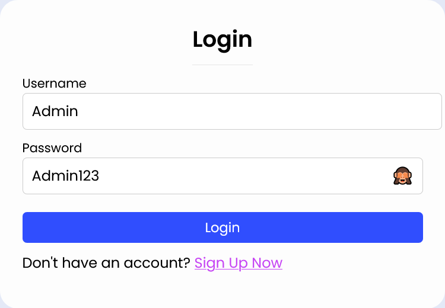

# ! **IMPORTANT – À LIRE AVANT TOUT :**

**Ouvrir cette feuille avec l’extension Jupyter dans VSCode :**
> Clic droit sur le fichier [README.md](README.md) → **"Ouvrir avec Jupyter Notebook (Preview)"**  
> ou utiliser **JupyterLab** pour une meilleure expérience de lecture.
---
#  But de la feuille

> Ce document explique comment exécuter et naviguer dans le site web **CaféGo**, un projet PHP HTML/CSS avec données JSON, dédié à la traduction de recettes.

---

##  Structure du projet

```text
├── Homepage/
    ├── home.html / home.php       → Page d'accueil
    ├── homeStyle.css              → Style général du site
    ├── profile.php                → Profil utilisateur
    ├── recipe.php                 → Affichage des recettes
    ├── recipes.php                → Gérer l'affichage des recette dans home
    ├── traduction.php             → Traduction d'une recette
    ├── recipes.php                → Liste de toutes les recettes
    ├── messages.json              → Données de messagerie
    ├── recipes.json               → Données des recettes
    ├── commentaires.json          → Commentaires utilisateurs
    ├── addrecipe.php              → Ajouter une recette 
    ├── update_pfp.php             → Modifier la page profile


├── Registration/
    ├── login.php                  → Connexion utilisateur
    ├── registration.css           → Style pour la page d'inscription (et traduction.php)
    ├── role.php                   → Choix de rôle (Cuisinier, Chef, Traducteur)
    ├── signup.php                 → Création de compte utilisateur
    ├── users.json                 → Données des utilisateurs 
    └── Images/                    → Dossier pour les images
```
---

##  Lancer le site localement

> 1. **Ouvre VS Code avec WSL** *(ou tout autre éditeur compatible avec PHP)*.
> 2. Lancer un serveur PHP avec la commande suivante dans le terminal :

```bash
php -S localhost:8000
```
###  Lancer le site localement

> Une fois le serveur lancé, le terminal vous proposera de suivre le lien suivant :

🔗 [http://127.0.0.1:8000/](http://127.0.0.1:8000/)

>  **Attention** : Pour commencer avec l'inscription, vous devez accéder manuellement à la page :
>
> [http://127.0.0.1:8000/Registration/signup.php](http://127.0.0.1:8000/Registration/signup.php)

---

###  Inscription

> Sur la page [signup.php](Registration/signup.php), vous devez saisir :
>
> - **Nom d'utilisateur**  
>   Si vous êtes un chef, ce nom servira aussi à vous identifier comme auteur.
> - **Email** (utilisé pour la récupération du mot de passe)
> - **Mot de passe** respectant les critères :
>   - au moins 8 caractères,
>   - une majuscule,
>   - une minuscule,
>   - un chiffre.
> - **Âge**

 Vous serez redirigé vers [role.php](Registration/role.php), où vous choisirez votre rôle :

> - 🧑‍🍳**Cuisinier** : consulter, liker, commenter les recettes, publier des photos, consulter son profil.
> - 👨‍🍳**Chef** : même droits + ajouter/modifier ses propres recettes.
> - 🌍 **Traducteur** : traduire toutes les recettes.

 Ensuite, vous serez redirigé vers **[home.html](Homepage/home.html)**.

>  L’admin doit valider votre rôle. En attendant, vous avez le rôle :
> `DemandeChef` ou `DemandeTraducteur`.

---

###  Connexion (**[login.php](Registration/login.php)**)

>Si vous avez déjà un compte :
> - Entrez votre **nom d'utilisateur** et **mot de passe** pour vous connecter.<br>
>
>Pour devenir admin un compte existe déjà. Il faut entrer le username et mot de passe suivant:
```bash
 Username: Admin
 Password: Admin123
```
Comme ceci:<br>


---

###  Profil (**[profile.php](Homepage/profile.php)**)

>- Cliquez sur l’icône en haut à droite pour accéder à votre profil.
>- Depuis cette page :
>  - Voir vos infos personnelles.
>  - Modifier via `update_pfp.php`.  
>    ! Vous devez changer au moins **le nom et l’email**.
>  - Une fois validé, retour à `profile.php`.
>  - Bouton **Back** pour revenir à `[**home.html**](Homepage/home.html)`.

---

###  Accueil (**[home.php](Homepage/home.php)**)

>- Appelle `recipes.php` pour charger les recettes.
>- **Fonctionnalités** :
>  - Filtres (ex. : *Vegan* → affiche les recettes vegan).
>  - Recherche par nom dans la  **barre de recherche** .
>  - Cliquer sur le **titre** ou **image** d’une recette :
>    redirection vers `recipe.php` avec le nom passé en paramètre.

---

###  Page Recette (**[recipe.php](Homepage/recipe.php)**)

>Sur cette page, vous pouvez :
>
>- Voir le **nom de l’auteur** de la recette.
>- Cliquer sur l’**icône de traduction** *(visible uniquement pour les traducteurs)*.
>- Cliquer sur l’**icône de modification** *(visible uniquement pour l’auteur)*.
>- Utiliser l’**icône de like** : une fois cliquée, l’image changera pour indiquer que vous avez aimé la recette.
>- Consulter :
>  - Les **ingrédients détaillés**.
>  - Les **étapes** de préparation.
>  - La **section de commentaires** pour :
>    - partager un message,
>    - **ajouter une image** à votre commentaire.

 Si vous publiez un commentaire, il apparaîtra **à la fin de votre propre liste de commentaires**.

---

###  Création de recette **[addrecipe.php](Homepage/addrecipe.php)**

Cette page permet à un utilisateur (auteur) de créer une nouvelle recette complète via un formulaire interactif.  
Les données sont ensuite enregistrées dans le fichier `recipes.json`.

####  Fonctionnalités disponibles :

- **Nom de la recette** en anglais (`name`) et en français (`nameFR`).
- **Filtres diététiques** à cocher :  
  `Vegan`, `Vegetarian`, `NoMilk`, `NoGluten`.
- **Ingrédients dynamiques** :
  - Chaque ingrédient comprend :
    - `Quantité`
    - `Nom`
    - `Type` (ex : Meat, Dairy, Misc, etc.) — boutons radio
  - Possibilité d’ajouter plusieurs ingrédients avec le bouton `+`
- **Étapes de préparation** :
  - En anglais (`steps[]`)
  - En français (`stepsFR[]`)
  - Ajout dynamique possible avec le bouton `+`
- **Timers** :  
  - Champ pour associer un temps à chaque étape (anglais ou français)
- **Validation & Sauvegarde** :
  - Vérifie si la recette existe déjà (par `name` ou `nameFR`)
  - Enregistre la nouvelle recette dans `recipes.json` si elle est unique et complète

---

###  Traduction (**[traduction.php](Homepage/traduction.php)**)

>En cliquant sur le bouton de traduction, vous accédez à cette page.
>
>Elle se présente sous forme de **deux colonnes**  🟥🟩:

- 🟥 Colonne de gauche : **texte en anglais**
- 🟩 Colonne de droite : **traduction en français**

>#### Fonctionnement :
>
>- Si vous êtes uniquement **traducteur**, vous pouvez **modifier uniquement les champs qui n’ont pas encore été traduits**.
>- Deux boutons sont disponibles :
>  - **"Traduire"** : met à jour les traductions générales.
>  - **"Translate"** : met à jour une autre section (gérée différemment dans le backend PHP).
>- Cliquer sur l’un des deux boutons :
>  - recharge la page,
>  - enregistre les modifications,
>  - affiche la traduction mise à jour.

---

####  Modification de recette (auteur uniquement)

>Si vous cliquez sur le bouton de **modification** :
>
>- Vous avez le droit de **modifier tous les champs** de la recette :
>  - en **français** et en **anglais**,
>  - ajouter ou supprimer des **ingrédients** ou **étapes**.
>
>Un **bouton "Retour"** est aussi présent en bas de la page pour revenir vers **[home.php](Homepage/home.php)**

---

###  Administration (**[admin.php](Registration/admin.php)**)

>##### Accessible uniquement aux administrateurs :
> - Consulter la **liste de tous les utilisateurs inscrits** et visualiser les **informations de chaque utilisateur** (nom, email, rôle, âge...).
> - Voir les utilisateurs ayant le rôle `DemandeChef` ou `DemandeTraducteur`.
> - Accepter ou refuser une **demande de rôle** (Chef ou Traducteur) via des boutons d'action.

---
